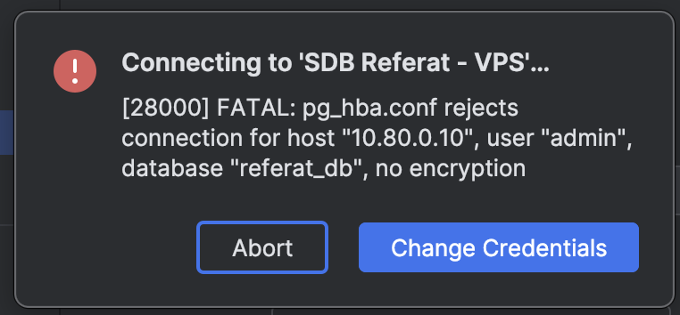
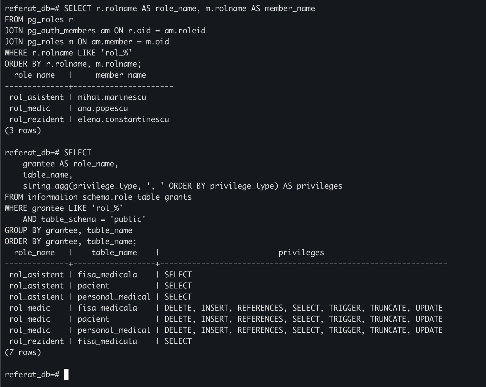
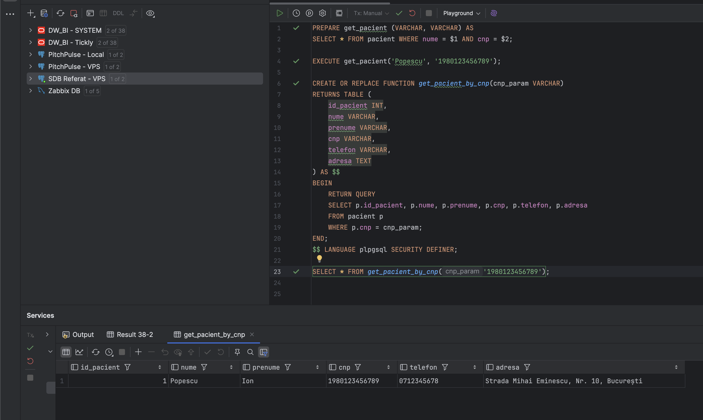

# Referat "Securitatea Bazelor de Date - PostgreSQL (Community)"

## Schema bazei de date

Pentru referatul acesta (care va vi implementat în continuare pentru aplicația de evaluare SBD) o să mă folosesc de un DB Schema simplu compus de 3 entitățiȘ
- pacient
- personal_meidcal
- fișă_medicală

Relațiile sunt următoarele:
- Pacient (1) ------- (N) Fișă_medicală
- Personal_medical (1) ------- (N) Fișă_medicală

[Fisier init.sql](./database/init.sql)


## Securitatea rețelei

Primul pas pentru securizarea bazei de date este de a stabili cine și cum poate accesa baza de date prin intermediul fișierului pg_gba.conf unde acolo se stabilește ce range-uri de IP sunt granted sau rejected pentru acces (Este practica bună să fie securizat la nivel de firewall acces-ul dar este bine să existe un onion layer în cazul în care firewall-ul nu mai funcționează).

```conf
# TYPE  DATABASE        USER            ADDRESS                 METHOD
local   all             all                                     scram-sha-256
host    all             all             127.0.0.1/32            scram-sha-256
host    all             all             10.80.0.0/16            scram-sha-256
host    all             all             0.0.0.0/0               reject
host    all             all             ::/0                    reject
```

Asta este o configurație minimală care permite acces-ul la baza de date in local cu parolă de autentificare; permite access-ul prin parola la userii care provin din range-ul de IP 10.80.0.0/16 (VPN in cazul acesta) și localhost; în final se dă reject la restul userilor care provin de altundeva la nivelul IPv4 și IPv6.

O vulnerabilitate era să fie trecut pentru tipul de conexiune `local` metoda `trust` unde se permitea conexiunea fară parolă.

O altă vulnerabilitate era folosirea metodei `md5` în loc de `scram-sha-256` deoarece md5 este mai nesigur (și-a pierdut setarea by default de la postgreSQL 14 unde scram-sha-256 este acum setat default).

MD5 ca să fie considerat sigur trebuie să îndeplineasca următoarele:
- Ar trebui să fie capabil să convertească ușor informații digitale, cum ar fi un mesaj, într-o valoare hash cu lungime fixă.
- Hash-ul trebuie să fie imposibil de decriptat din punct de vedere computational pentru a obține orice informații despre mesajul de intrare.
- Din punct de vedere computational, trebuie săe fie imposibil să se găsească două fișiere cu un hash identic.

Din păcate al treilea punct nu este îndeplinit deoarece este posibil să se genereze același hash pentru două fișiere diferite; situația asta aduce la atacuri de tip coliziune, o vulneraibilitate extrem de ridicată, deoarece pot sa generez acelasi hash pentru o altă parolă spre exemplu.
https://repo.zenk-security.com/Cryptographie%20.%20Algorithmes%20.%20Steganographie/MD5%20Collisions.pdf

O altă metodă buna pentru securizarea accesului prin rețea este setarea tipului de conexiune in loc de `host` cu `hostssl`. Pentru referat nu vom folosi SSL.

Conexiune prin hostssl (eșec)


Conexiune prin host (success)


## Controlul accessului

Pnetru referatul acest, o să abordez despre 3 tip-uri de access control (mentionate și la cursul SBD)Ș
- RBAC Role Based Access Control
- MAC Mandatory Access Control
- DAC Discretionary Access Control

### RBAC

Acest tip de access control bazează accessul prin roluri. În loc de a configura pentru fiecare personal_medical ce are voie să facă, să vadă, să modifice, să steargă (CRUD), stabilim asta pe baza de rol așa că daca e nevoie să se steargă/adauge/modifce o regulă de access, este mai ușor de intretinut/mentinut pentru ca se face doar odată schimbarea.

[Fisier acces.sql](./database/access_control/RBAC/access.sql)


Dupa ce am creat rolurile/userii pentru access, putem testa (prin linie de comandă).

Se poate observa că medicul chair are access la orice (poate să adauge/stearga pacienti noi spre exemplu), când asistentul vede totul dar nu are drept de modificarea/ștergerea/adaugarea a datelor. În final, rezidentul are acces doar la fișele medicale.

Rol Medic


Rol Asistent


Rol Rezident


Verificare roluri


### DAC

Acest tip de access control permite proprietarului unui obiect (tabel, înregistrare) să decidă direct cine are acces. Permisiunile sunt acordate individual fiecărui utilizator, oferind control granular asupra accesului la date.

[Fisier acces.sql](./database/access_control/DAC/access.sql)

Cum se poate observa, dupa ce medicul a primit rolul de SELECT access pe fisa_medicala cu optinue de a da mai departe, userul elena.constantinescu (asistent) a primit permisiunea de SELECT pe acelasi tabel si se poate observa ca a primit accessul.

Testare DAC


### MAC

Acest tip de access control este impus de sistem pe baza unor etichete de securitate și reguli stricte (în cazul âsta `grad_acreditare` pentru personal și `nivel_clasificare` pentru fițele medicale). Accesul este determinat de nivelul de clasificare al datelor și al utilizatorului, fără posibilitatea modificării de către utilizatori (prin intermediul RLS - Row Level Security).

[Fisier acces.sql](./database/access_control/MAC/access.sql)


Dupa ce s-a rulat acces-ul pentru RLS, se poate vedea cum fiecare user poate sa vadă doar înregistrările care au nivelul_clasificare mai mic sau egal cu propriul lor grad_acreditare.

Testare MAC


## Auditare

Auditarea permite înregistrarea tuturor operațiunilor efectuate asupra datelor sensibile pentru a putea urmări și analiza accesul la informații. În PostgreSQL, aceasta poate fi implementată folosind trigger-uri care înregistrează automat fiecare operațiune (INSERT, UPDATE, DELETE) într-un tabel de audit.

[Fisier audit.sql](./database/audit/audit.sql)

Implementarea folosește un tabel `audit_log` care stochează:
- Tabelul afectat
- Tipul operației (INSERT, UPDATE, DELETE)
- Utilizatorul care a efectuat operația (session_user)
- Timestamp-ul acțiunii
- Datele vechi și noi (pentru UPDATE)
- Adresa IP a utilizatorului

Trigger-ele sunt configurate pentru toate tabelele sensibile (fisa_medicala, pacient, personal_medical) și se declanșează automat la fiecare modificare.

Testare Insert


Verificare Audit


### Alternativă: pgAudit

Se poate folosi extensia "pgAudit" pentru medii de producție, care oferă auditare detaliată la nivel de sesiune și obiect. Toate operațiunile PostgreSQL sunt înregistrate de pgAudit și pot fi analizate folosind pgAudit Analyze, care încarcă datele într-un schema de bază de date pentru analiză.

Beneficiile pgAudit includ auditare la nivel de sesiune (toate comenzile SQL), auditare la nivel de obiect (DDL, DML pe anumite tabele) și integrare cu sistemul de logare PostgreSQL. De asemenea, pgAudit Analyze permite analiză avansată.

https://access.crunchydata.com/documentation/pgaudit-analyze/1.0.9/pdf/pgaudit_analyze.pdf

## Prevenirea SQL Injection

Un atacator folosește SQL Injection, care este printre cele mai frecvente atacuri asupra bazelor de date, în care injectează cod SQL fals în interogări prin concatenarea string-urilor. Soluția implică interogările parametrizate pregătite, care separă codul SQL de datele utilizatorului.

[Fisier exemplu](./database/security/sql_injection_example.sql)

În PostgreSQL, se pot folosi prepared statements cu `PREPARE` și `EXECUTE`, sau funcții PL/pgSQL care acceptă parametri. Acestea previne injectarea de cod SQL deoarece parametrii sunt tratați ca date, nu ca parte a comenzii SQL.

Testare Injection


Verificare Injection


## Criptarea Datelor

Criptarea datelor este esențială pentru protejarea informațiilor sensibile împotriva accesului neautorizat. PostgreSQL oferă multiple opțiuni de criptare la diferite niveluri, oferind flexibilitate în protejarea datelor împotriva furtului serverului, administratorilor necinstiti și rețelelor nesigure.

### Tipuri de Criptare

PostgreSQL suportă următoarele tipuri de criptare:

- **Full Disk Encryption** - Criptare completă a discului sau partiției
- **File System Encryption** - Criptare la nivel de sistem de fișiere
- **Column Level Encryption** - Criptare pentru coloane specifice cu date sensibile
- **Password Storage Encryption** - Criptare pentru stocarea parolelor

[Fisier exemple criptare](./database/security/encryption_examples.sql)

### Full Disk Encryption - La nivel de OS

Una dintre cele mai bune metode de protejare a datelor este criptarea completă a discului sau a partiției. Această tehnică asigură protecția atât a fiecărui fișier, cât și a stocării temporare care poate conține părți ale acestora. Nu trebuie să te îngrijorezi să alegi ce fișier vrei să protejezi, deoarece criptarea completă a discului protejează toate fișierele.

Avem diverse opțiuni (depinde de OS-ul pe care îl folosim):
- **FileVault** - pentru macOS


- **BitLocker** - pentru Windows 


- **LUKS (Linux Unified Key Setup)** - pentru Linux

### File System Encryption

Criptarea la nivel de sistem de fișiere, denumită și criptare de fișiere sau directoare, este atunci când sistemul de fișiere însuși criptează fișierele sau directoarele.

**Notă importantă:** Criptarea la nivel de sistem sau disc complet protejează fișierele sau discurile împotriva atacurilor fizice pe hardware care nu rulează (cum ar fi un hard disk furat), dar nu protejează sistemul care rulează, nici nu permite utilizatorilor să controleze datele din baza de date.

### Column Level Encryption

Pentru criptare la nivel de coloană, se poate folosi extensia pgcrypto. Aceasta permite criptarea selectivă a coloanelor cu date sensibile, cum ar fi numerele CNP și cardurile de credit.

În cazul tabelelor pe care le avem, am creat o entitate noua pentru a arata diferenta intre a citi având cheia de decriptare și fară cheie.

După ce am creat uneltele necesare (verificați `encryption.sql`), mai jos se poate observa diferenta când, după ce s-a introdus pacient-ul cu criptarea cnp-ului, se face citirea fâră sau cu cheie.

Fâră cheie de decriptare


Cu cheie de decriptare


Pentru tabelul curent `pacient`, am criptat coloana prin comanda următoare

```sql
ALTER TABLE pacient
ALTER COLUMN cnp TYPE BYTEA
USING encrypt_cnp(cnp, 'portocal12');
```
Pacient criptat


### Network-based Encryption

Criptarea la nivel de rețea protejează datele în tranzit între client și server. În PostgreSQL, aceasta se realizează prin SSL/TLS. Am menționat anterior opțiunea `hostssl` în `pg_hba.conf` care necesită conexiuni SSL.

### Password Storage Encryption

PostgreSQL folosește deja criptare pentru stocarea parolelor. Am menționat anterior folosirea `scram-sha-256` în loc de `md5` pentru autentificare.
